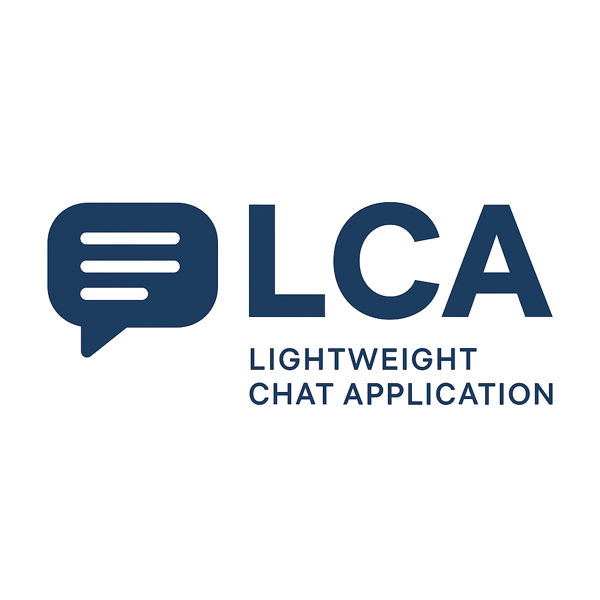

<p align="center">
  
</p>

# LCA
A concise and lightweight open message chat system powered by Go.

## 🚀 Overview

LCA is a simple and extensible WebSocket-based and RestFulAPI message chat system written in Go. It is designed to be easily deployable and modifiable for various real-time communication use cases.

## Get Started 

####  Step 1 - Clone the repository
```git
git clone https://github.com/wang900115/LCA.git
```
####  Step 2 - Change to the new directory
```cmd
cd LCA
```
####  Step 3 - Build and run application
```cmd
make run
```

```docker
docker build -t lca-server .
docker run -p 8080:8080 lca-server
```
The application will start on the default port (e.g., localhost:8080). You can configure this in the yaml configuration

## Licensing
Open Source License: Root and subdirectories.
