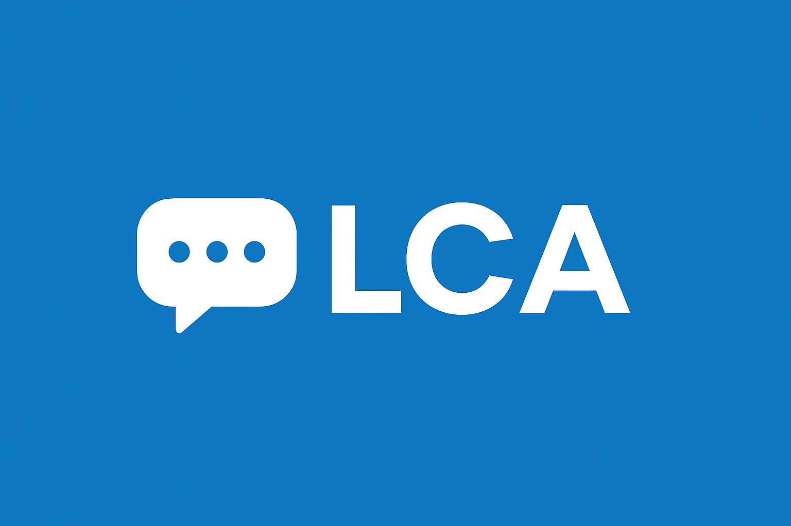

<h1 align="center"><strong>Lightweight Chat Application (LCA)</strong></h1>

  

---

## 📌 Overview
**LCA** (Lightweight Chat Application) is a secure and lightweight messaging platform.  
It is designed to support both **RESTful APIs** and **WebSocket communication**, while maintaining **centralized management** for enhanced system security.

---

## 🧠 Knowledge & Core Features
- **API Protocol**
  - RESTful APIs for user and message management  
  - WebSocket channels for real-time communication  
  - Supports event-driven architecture for scalability  

- **Security**
  - **PASETO** and **JWT** for authentication and session management  
  - Strong defense against unauthorized access or tampering  

---

## 🔧 Prerequisites
Before you start, make sure you have:

- **Golang** `>= 1.25.0`
- **Docker** (images will be pulled automatically from Docker Hub)
- **Local setup (optional)**  
  - PostgreSQL server  
  - Redis service  

---
## Download Build 

You can download the lastest build here:
  - [Windows](https://github.com/wang900115/LCA/releases/latest/download/main.exe)
  - [Linux](https://github.com/wang900115/LCA/releases/latest/download/main)

## Get Started
> [!WARNING]  
> If running locally, please verify you meet the prerequisites above. 
  - *Docker*
    -  Run:  `docker-compose up --build`
    -  ShutDowan:  `docker-compose down`
  - *Local* 
    - Window: 
      -  Build: `go build -o build ./cmd/LCA/main.go`
      -  Run: `./build/main.exe`
    - Linux:
      -  Build: `make build`
      -  Run: `make run`

## Question
  If you have any questions, please send me the ISSUE. I will personally understand and check if there are any omissions. Keep doing the best.

## Contributer
  - Main Dev: 
    - Name: Perry
## Licensing
  This project, LightWeight Chat Application (LCA), is released under an open-source license to encourage collaboration, transparency, and innovation in decentralized secure communication systems. We currently use the following license: MIT License You are free to: Use, Copy, Modify, Merge, Publish, and Distribute the software Use it for personal, educational, or commercial purposes Provided that: You include the original copyright and license You provide attribution to the original authors For the full license text, refer to the LICENSE file in the repository.