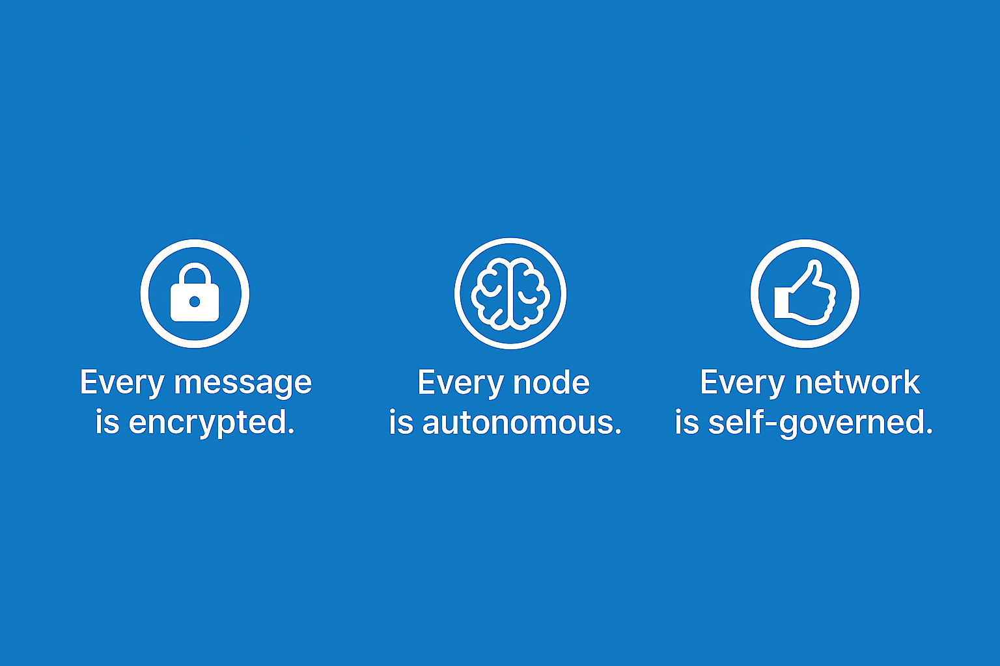

 <h1 align="center"><strong>Lightweight Chat Application</strong></h1> 
    

      
    

  
## Overview
  **LCA** is a message chat hybrid system written in Go. It is designed for Decentralized encrypted communication. However, central management is still the priority for system security.

## Knowledge
  - **Decentral Auth:** Decentral concept is this project main idea, like gossip protocal peer2peer , and it cause to be strong community. each node be not only either giver still recevier. Staggered interact between Opher-Chain(which maintence by your self) and Channel (which maintence by goverment).
  - **Encryption:**  Using RSA Algorithm in sender side(Merkle Patricia Tree for node completely).
  - **Distributed System:** Distributing theorm like CAP,(Consistence, Availability, Partition Tolerance) and BASE(Basically Available, Soft State, Eventual Consistency) with Quorum system design method for paxos, raft ... algorithms.
  - **Security:** According PASETO and JWT tech to increase hack difficulty 

## Prerequisite 
  - Golang Version >= 1.25.0
  - Docker Installed (images come from pulling hub)
  - If using Local (should have postgresql server and redis service)

## Download Build 

You can download the lastest build here:
  - [Windows](https://github.com/wang900115/LCA/releases/latest/download/main.exe)
  - [Linux](https://github.com/wang900115/LCA/releases/latest/download/main)

## Get Started
> [!WARNING] if Using local please check prerequsite 
  - *Docker*
    -  Run:  `docker-compose up --build`
    -  ShutDowan:  `docker-compose down`
  -  *Local* 
    - Window: 
      -  Build: `go build -o build ./cmd/LCA/main.go`
      -  Run: `./build/main.exe`
    - Linux:
      - Build: `make build`
      - Run: `make run`

## Question
  If you have any questions, please send me the ISSUE. I will personally understand and check if there are any omissions. Keep doing the best.

## Contributer
  - Main Dev: 
    - Name: Perry
## Licensing
  This project, Decentraling Encrypt Chat Application (DECA), is released under an open-source license to encourage collaboration, transparency, and innovation in decentralized secure communication systems. We currently use the following license: MIT License You are free to: Use, Copy, Modify, Merge, Publish, and Distribute the software Use it for personal, educational, or commercial purposes Provided that: You include the original copyright and license You provide attribution to the original authors For the full license text, refer to the LICENSE file in the repository.